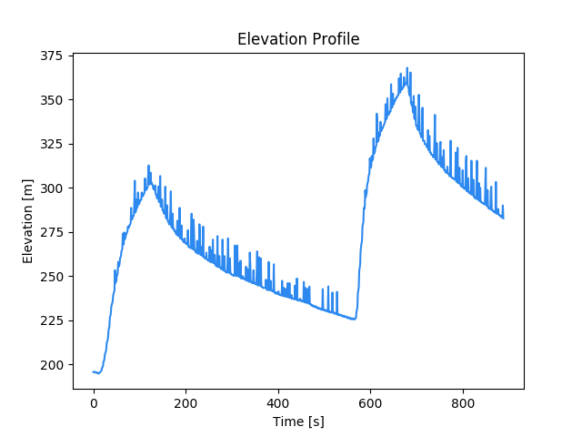

# GPXOverlay
This is a basic Python library that takes a GPX file (GPS data) and a video and
overlays the GPS data onto individual frames of the video. While there already is
existing software to overlay GPS data on a video, this project is unique as it
allows users to create their own custom overlay widgets using HTML. As far as I
am aware, no other software provides this customizability.

The project is still in the early stages and features will be continue to be added.

Here's some example output of overlaying speed (top left corner) on top of a
video recorded by a drone.


## Installation
### macOS
1. Setup a virtual environment

```bash
python3 -m venv env
source env/bin/activate
```

2. From the main directory, install `GPXOverlay` as an editable local pip package

```bash
pip3 install -e .
```

3. Install `wkhtmltopdf` and `ffmpeg` dependencies

```bash
brew cask install wkhtmltopdf
brew install ffmpeg
```

### Windows
1. Setup a virtual environment

```powershell
python -m venv env
.\env\Scripts\Activate.ps1
```

2. From the main directory, install `GPXOverlay` as an editable local pip package

```powershell
pip install -e .
```

3. Install `wkhtmltopdf` and `ffmpeg` dependencies

```powershell
choco install wkhtmltopdf
choco install ffmpeg
```

## Main Concept
The GPS data stored in the GPX file contains many trackpoints containing
elevation, longitude, and latitude.

```xml
<trkpt lat="43.6394830" lon="-79.3760640">
 <ele>74.6</ele>
 <time>2019-09-21T11:23:09Z</time>
 <extensions>
  <gpxtpx:TrackPointExtension>
   <gpxtpx:cad>88</gpxtpx:cad>
  </gpxtpx:TrackPointExtension>
 </extensions>
</trkpt>
```

The GPX file is itself an XML file that uses the [TopoGrafix GPX 1.1 Schema](https://www.topografix.com/gpx/1/1/).
I've included some example GPX files that I collected during a morning run or
made using random data (`sample-data.gpx`, `sample-data-long.gpx`, `sample-data-short.gpx`).

This XML file then needs to be parsed to extract relevant data, before processing
the data to get speed, distance, etc.


This can be done in a few lines using the code from this library:

```python
# load GPX file into an Analysis object
data = analysis.Analysis('sample-data-short.gpx')
# extract elevation, time, and velocity data as a numpy array of values
elevations = data.elevation_data
times = data.time_data
velocities = data.velocity_data
```

This can then be used in various ways, such as graphing the data using matplotlib
(See `examples/analyze_elevation.py` for more detail):



Overlaying the data onto a video can be done using an `Overlay` object that I've
built into this library:

```python
# load GPX file into an Overlay object and provide a path for output video
elevation_overlay = overlay.Overlay('sample-data-short.gpx', 'video.mp4')
elevation_overlay.generate_elevation_frames()
elevation_overlay.convert_elevation_frames_to_video()
elevation_overlay.overlay_elevation()
```


Once again, examples are provided. See `examples/overlay_elevation.py` and `examples/overlay_speed.py`

**Note:** The elevation data does not correspond with the video because I do not
have a drone myself and do not have access to a matching set of GPS data and
footage. If I come across a set of data that I am allowed to use, I will definitely
update this later.

## Running examples
Run this command in the main directory
```shell
cd examples
python3 overlay_speed.py
python3 overlay_elevation.py
python3 analyze_elevation.py
```

## Project Overview & External Libraries Used
1. Parse XML using `ElementTree` and use `dateutil.parser` for time related data
2. Process extracted data to get speed, distance, etc using `numpy`
3. Use and modify `HTML` templates using `jinja2`
4. Generate graphs using `matplotlib`
5. Generate video frames as PNG images using `imgkit` (a python wrapper for `wkhtmltopdf`)
6. Generate PNG image using processed data and HTML widgets with `BeautifulSoup`
and `imgkit`
7. Convert PNG frames to a single video and overlay the video onto the input video using `ffmpeg-python` (a python wrapper for `FFmpeg`)

**Note:** Currently the process to generate the output video is to convert each
 overlay image into a video and then overlay that video onto the input video. A
 more efficient way would be to overlay the image directly onto individual
 frames of the input video. I went with the current approach because it was the
 easiest to prototype and didn't require any complicated logic when using the
 `ffmpeg-python` library. While this method is slower, it ultimately doesn't add
 too much time to the overall process because `ffmpeg-python` is very fast. The
 time limiting step is actually generating each frame. Reading and modifying the
 HTML, as well as generating the image, was much slower than I anticipated, but
 I guess that's a lesson learned for next time.

## Project Structure
```
├── GPXOverlay
│   ├── __init__.py
│   ├── analysis.py
│   ├── calculations.py
│   ├── frame.py
│   ├── overlay.py
│   ├── static
│   │   ├── elevation_template.css
│   │   └── speed_template.css
│   └── templates
│       ├── elevation_template.html
│       └── speed_template.html
├── README.md
└── examples
    ├── analyze_elevation.py
    ├── overlay_elevation.py
    ├── overlay_speed.py
    ├── sample-data-long.gpx
    ├── sample-data-short.gpx
    └── video.mp4
```

## TODO
1. Set up default templates
2. Set up interpolation
3. Add intermediate progress bar and/or status info when running library in terminal
4. Add error messages and exceptions to handle edge cases


## Features to add later
1. Support for videos w/ different frame rates (sped up, slowmotion, hyperlapses)
2. Support for Garmin Track Point and Cluetrust GPX extensions
3. Display Heart Rate
4. Display Power
5. Route maps


## Motivation and Use Cases
I originally got this idea after watching some hyperlapses that I recorded while
running and biking. While the videos were definitely really cool, I thought that
they could be improved if there was more context. Especially since the videos
were sped up, I couldn't tell if I was actually going fast or if the video was
just sped up a lot. Furthermore, it was hard to judge the amount of effort I was
putting in without the elevation or speed data.

So while I was looking for software to overlay GPX data on a video, I noticed
that some required specific devices/models or required that the same device be
used to record both GPS and video. However, I currently record the GPS data and
video on separate devices (running watch and a GoPro), and I can imagine a few
use cases where it wouldn't be ideal/possible to use a single device. Furthermore,
I wanted to be able to choose/design my own widgets rather than using the standard
ones that came with the software. At this point I realized that I probably could
build something myself that could meet my needs as well as get some good coding
practice.

While the clips below from my triathlon training are all filmed POV, this project
could definitely be used with any type of video. I just happen to record mostly
POV and haven't gotten any good examples. Anyways, thanks for reading through this
and if you have any comments, I'd love to hear them!


