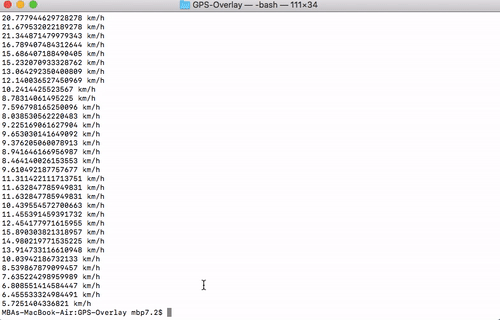

# GPS-Overlay
This is a basic Python project that takes a GPX file (GPS data) and a video and
overlays the GPS data onto individual frames of the video. While there already is
existing software to overlay GPS data on a video, this project is unique as it
allows users to ceate their own custom overlay widgets using HTML. As far as I
am aware, no other software provides this customizability.

The project is still in the early stages and features will be continue to be added.


## Main Concept
The GPS data stored in the GPX file contains many trackpoints containing elevation,
longitude, and latitude.

```xml
<trkpt lat="43.6394830" lon="-79.3760640">
 <ele>74.6</ele>
 <time>2019-09-21T11:23:09Z</time>
 <extensions>
  <gpxtpx:TrackPointExtension>
   <gpxtpx:cad>88</gpxtpx:cad>
  </gpxtpx:TrackPointExtension>
 </extensions>
</trkpt>
```

The GPX file is itself an XML file that uses the [TopoGrafix GPX 1.1 Schema](https://www.topografix.com/gpx/1/1/).
An example GPX file that I collected during a morning run (exported from Strava) is also
included in this repository (`sample-data.gpx`).

This XML file then needs to be parsed to extract relevant data, before processing
the data to get speed, distance, etc.



Using the included widgets or user-defined HTML widgets with the GPS data, an image
can be generated for each trackpoint.

Finally, each generated image can be overlayed over individual frames of the input video


## Project Overview & External Libraries Used
1. Parse XML using `ElementTree`
2. Process extracted data to get speed, distance, etc
3. Generate PNG image using processed data and HTML widgets with `BeautifulSoup`
and `imgkit`
4. Overlay PNG onto video frames using `ffmpeg`


## To Be Completed for MVP
1. Video frame-by-frame overlay code
2. HTML overlays
- speed
- elevation
- distance

## Features to add later
1. Support for videos w/ different frame rates (sped up, slowmotion, hyperlapses)
2. Support for Garmin Track Point and Cluetrust GPX extensions
3. Display Heart Rate
4. Display Power
5. Route maps


## Motivation and Use Cases
I originally got this idea after watching some hyperlapses that I recorded while
running and biking. While the videos were definitely really cool, I thought that
they could be improved if there was more context. Especially since the videos
were sped up, I couldn't tell if I was actually going fast or if the video was
just sped up a lot. Furthermore, it was hard to judge the amount of effort I was
putting in without the elevation or speed data.

So while I was looking for software to overlay GPX data on a video, I noticed
that some required specific devices/models or required that the same device be
used to record both GPS and video. However, I currently record the GPS data and
video on separate devices (running watch and a GoPro), and I can imagine a few
use cases where it wouldn't be ideal/possible to use a single device. Furthermore,
I wanted to be able to choose/design my own widgets rather than using the standard
ones that came with the software. At this point I realized that I probably could
build something myself that could meet my needs as well as get some good coding
practice.

While the clips below from my triathlon training are all filmed POV, this project
could definitely be used with any type of video. I just happen to record mostly
POV and haven't gotten any good examples. Anyways, thanks for reading through this
and if you have any comments, I'd love to hear them!


